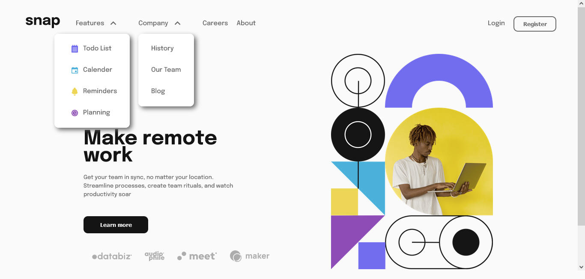

# Frontend Mentor - Intro section with dropdown navigation solution

This is a solution to the [Intro section with dropdown navigation challenge on Frontend Mentor](https://www.frontendmentor.io/challenges/intro-section-with-dropdown-navigation-ryaPetHE5). Frontend Mentor challenges help you improve your coding skills by building realistic projects.

## Table of contents

- [Overview](#overview)

  - [The challenge](#the-challenge)
  - [Screenshot](#screenshot)
  - [Links](#links)
  - [Built with](#built-with)
  - [Continued development](#continued-development)
  - [Useful resources](#useful-resources)

- [Author](#author)

## Overview

### The challenge

Users should be able to:

- View the relevant dropdown menus on desktop and mobile when interacting with the navigation links
- View the optimal layout for the content depending on their device's screen size
- See hover states for all interactive elements on the page

### Screenshot

### Links

- Solution URL: [Github](https://github.com/Yusfuldev/FEM-Intro-section-with-dropdown-navigation)

### Built with

- Semantic HTML5 markup
- CSS custom properties
- Flexbox
- Javascript
- Mobile-first workflow

### Continued development

I still have to learn how i can close a nav menu by clicking anywhere on the page.

Also about event bubbling

### Useful resources

-  - This helped me with the sliding nav menu. I really liked this pattern and will use it going forward.
-  - This is an amazing source which helped me finally understand event bubbling.

## Author

- Website - [Netlify-profile](https://app.netlify.com/teams/yusfuldev/overview)
- Frontend Mentor - [frontend-mentor-profile](https://www.frontendmentor.io/profile/yusfuldev)
- Twitter - [Twitter](https://www.twitter.com/hadebayo4u)
- Github - [Github](https://www.github.com/Yusfuldev)
